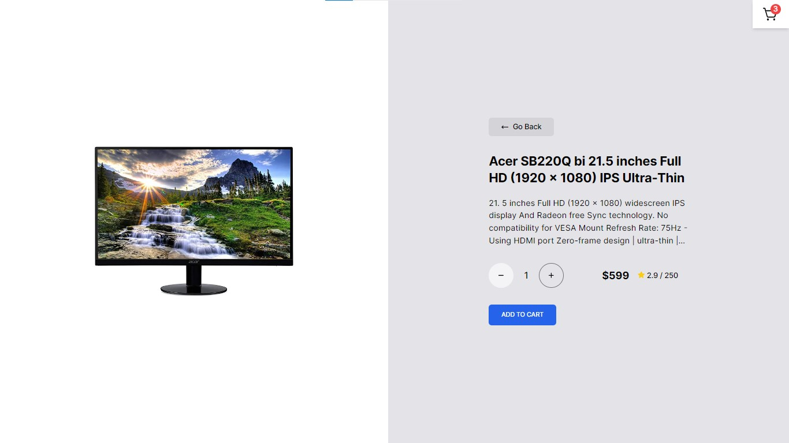

# E-Commerce Platform with Next.js

 This is a basic E-Commerce Platform built with Next.js! This platform is designed and developed by me, a passionate Frontend Developer with expertise in React.js, Next.js,TypeScript,  JavaScript, and Tailwind CSS & more.




## Live Demo 🚀
[click here to view the live demo](https://next-js-ecommerceapp.vercel.app)

## Dependencies 📚
1. Next Js
2. Framer Motion
3. Redux Toolkit / RTK-Query
4. Tailwind CSS
5. React Icons

## Features ✨
1. **Skeleton Loading:** Incorporate a loading skeleton to improve user experience during data loading.

2. **Page Transition:** Utilize Framer Motion to implement smooth page transitions, enhancing the overall user interface.

3. **Data Persistence on Client:** Ensure that cart data is persistently stored on the local storage.


## Run Locally 💻

```bash
git clone https://github.com/vishal-gg/Next.js-E-commerce.git
cd Next.js-E-commerce
npm install
npm run dev
```

## Troubleshooting ⚙

If you encounter any issues while setting up or running the E-Commerce Platform, feel free to reach out for assistance. Here are some common problems and their solutions:

### Problem: Node.js Version Compatibility

Make sure you have the correct version of Node.js installed. The project is tested with Node.js version 20.5.0 You can download the recommended version from [here](https://nodejs.org/).

### Problem: Dependency Installation

If you face issues during the `npm install` step, try the following:

```bash
npm cache clean --force
npm install
```